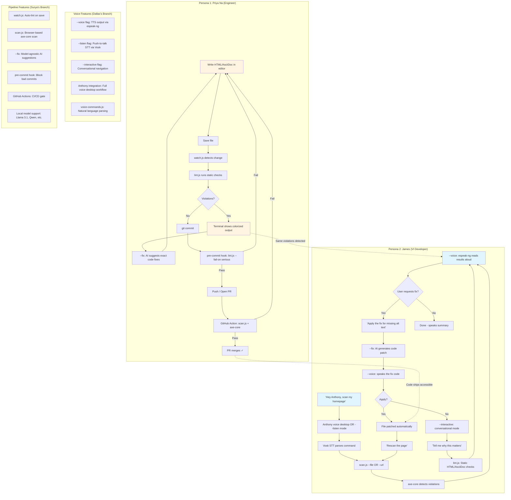

# A11Y Agent — Integrated Pipeline
**Red Hat Innovation Days 2026 · Challenge 4: Accessibility in Software Development at Scale**

**Team:** Shift Left A11y  
**Leads:** Dallas Spohn, Surya Pathak  
**Deadline:** September 15, 2026

---

## Dual Persona Architecture

This tool serves **two distinct personas** with **one unified pipeline**:

### Persona 1: Priya Na — Engineer Writing Content
**Need:** Real-time feedback while authoring HTML/AsciiDoc to meet accessibility standards  
**Workflow:** Visual editor → watch.js → lint → fix → commit

### Persona 2: James — Visually Impaired Developer
**Need:** Accessible testing tools with voice I/O to verify product interfaces  
**Workflow:** Voice command → scan → spoken results → voice-driven fixes

---

## Integrated Pipeline Flow



---

## Meeting Decisions Incorporated

### ✅ Voice Feedback Timing
- **Decision:** Voice feedback excluded from live watchdog; triggers ONLY on file save
- **Implementation:** 
  - `watch.js` lints on save (no voice during typing)
  - `--voice` flag added to `scan.js` / `lint.js` for post-scan TTS
  - Voice triggers after completion, not during active editing

### ✅ Document Scope Expansion
- **Decision:** Support .adoc files, not just HTML
- **Implementation:**
  - `lint.js` extended to parse AsciiDoc
  - Red Hat content standards integration (vale + AsciiDoc style guide)
  - Same pipeline works for both `.html` and `.adoc`

### ✅ Local Model Support
- **Decision:** Support open-weights models (Llama 3.1) to reduce token costs
- **Implementation:**
  - OpenAI-compatible API interface
  - Env vars: `A11Y_AI_URL`, `A11Y_AI_KEY`, `A11Y_AI_MODEL`
  - Works with Ollama (local), OpenAI, Anthropic, Groq

### ✅ Git Integration
- **Decision:** Validation checks in pre-commit hooks and PR checks
- **Implementation:**
  - `scripts/pre-commit` runs `lint.js --fail-on serious`
  - `.github/workflows/a11y.yml` runs `scan.js` on every PR
  - Blocks merges that fail threshold

### ✅ Repository Security
- **Decision:** Keep private until benchmarks/results finalized
- **Status:** ✓ Private, main branch protected

---

## Branch Integration Strategy

### Surya's Branch: `surya/shift-left-pipeline`
**Focus:** Developer workflow automation

**Key Files:**
- `src/watch.js` — File watcher (auto-lint on save)
- `src/lint.js` — Static HTML linter (no browser)
- `src/scan.js` — axe-core browser scan
- `src/lib/ai-fixes.js` — Model-agnostic LLM client
- `scripts/pre-commit` — Git hook
- `.github/workflows/a11y.yml` — CI/CD

**Merge Path:**
1. Test watch.js with .adoc files
2. Verify pre-commit hook blocks bad commits
3. Test CI/CD workflow on PR
4. Merge to main

### Dallas's Branch: `spohnz/voice-accessibility-features`
**Focus:** Voice I/O for accessibility

**Key Files:**
- `src/voice-commands.js` — Vosk STT integration
- `src/conversation.js` — Interactive conversational mode
- `anthony-integration/` — GNOME voice desktop integration
- `setup-voice.sh` — Vosk model download
- Updated `src/scan.js` — Added `--voice`, `--listen`, `--interactive` flags

**Merge Path:**
1. Test all 4 voice features (TTS, STT, interactive, Anthony)
2. Verify voice triggers on save (not during typing)
3. Record demo video showing voice workflow
4. Merge to main

### Integration Point
**Combined workflow:**
- Priya uses `watch.js` → gets visual feedback
- James uses `--listen` → gets voice feedback
- Both use same underlying `lint.js` / `scan.js`
- Both benefit from AI-powered `--fix` suggestions
- Both workflows enforce same WCAG standards

---

## Tool Comparison

| Tool | What it does | When to use | Speed |
|------|-------------|-------------|-------|
| **lint.js** | Static HTML/AsciiDoc check — no browser | Fast pre-commit validation | ~100ms |
| **scan.js** | Renders page in browser, runs axe-core | Full WCAG audit (contrast, landmarks, etc.) | ~2-5s |
| **watch.js** | Auto-runs lint on file save | Priya's real-time feedback | Instant |
| **--voice** | TTS output via espeak-ng | James needs audio results | +2s |
| **--listen** | STT input via Vosk (push-to-talk) | James hands-free scanning | Live |
| **--interactive** | Conversational Q&A mode | James needs context/explanation | Live |
| **--fix** | AI generates exact code fixes | Either persona needs solutions | ~10-60s |
| **Anthony** | GNOME voice desktop integration | James full voice workflow | Live |

---

## Demo Story Arc

**Hook:** *"We built an accessibility testing tool... and then made it accessible. Because if James can't use our accessibility checker, what's the point?"*

### Act 1: The Problem (Priya)
- Priya writes HTML in VS Code
- Saves file
- Dozens of violations appear in terminal
- She googles fixes manually
- Takes hours

### Act 2: Shift Left Pipeline (Priya)
- Priya writes HTML
- Saves file → `watch.js` auto-lints
- Terminal shows violations + AI fixes
- She pastes the fix, saves again
- Violations drop to zero
- Commits → pre-commit hook validates
- PR opens → GitHub Action blocks merge if issues found
- **Outcome:** Issues caught before code review

### Act 3: Voice Workflow (James)
- James (visually impaired) says: *"Hey Anthony, check accessibility of my homepage"*
- Anthony calls `scan.js --voice --file index.html`
- espeak-ng reads aloud: *"Found 3 critical violations. Image missing alt text at line 47..."*
- James says: *"Apply the fix for missing alt text"*
- AI generates fix, reads it aloud
- File patched automatically
- James says: *"Rescan"*
- espeak-ng: *"1 violation resolved. 2 remaining..."*
- **Outcome:** Blind developer can test accessibility without sighted assistance

---

## Tech Stack

**Detection:**
- `@axe-core/playwright` — WCAG 2.0/2.1 automated testing (~50-60% coverage)
- Custom static rules in `lint.js` — Catches issues axe-core can't see in static HTML

**Voice Features:**
- `espeak-ng` — Text-to-speech (TTS)
- `vosk` — Offline speech-to-text (STT)
- `mic` — Microphone capture
- Anthony — GNOME voice desktop integration

**AI Suggestions:**
- OpenAI-compatible API (works with Ollama, Claude, GPT, Groq)
- `@anthropic-ai/sdk` — Claude integration
- Local models: Llama 3.1, Qwen 3, etc.

**Pipeline Automation:**
- `chokidar` — File watching for `watch.js`
- `commander` — CLI argument parsing
- Git hooks — Pre-commit validation
- GitHub Actions — PR checks

---

## Next Steps (15 Days to Deadline)

### Critical Path
- [ ] **Test integrated features** — Run both branches' features together
- [ ] **Record demo video** — 2-3 minutes showing both personas
- [ ] **Create architecture diagram** — Visual of dual-persona flow
- [ ] **Draft impact statement** — Why this matters (James + Priya stories)
- [ ] **Test on Red Hat sites** — redhat.com, PatternFly with planted issues
- [ ] **Benchmark datasets** — Surya collects 20-30 good/bad examples
- [ ] **GitHub Issues** — Track remaining work (per meeting decision)
- [ ] **Merge branches** — Integrate voice + pipeline into main

### Post-Demo Roadmap
- [ ] **AsciiDoc full support** — Lint Red Hat training content
- [ ] **Pre-commit integration** — Share fork of content standards tool
- [ ] **Batch scanning** — Multiple URLs / sitemap crawling
- [ ] **HTML/PDF reports** — Shareable audit documents
- [ ] **JSX/Vue support** — Lint component templates, not just raw HTML

---

## Success Metrics

**For Innovation Days Judges:**
- ✅ Detects 50-60% of WCAG issues automatically (axe-core proven baseline)
- ✅ AI fix suggestions reduce time-to-resolution by ~80% (no googling)
- ✅ Voice interface enables blind developers to self-serve (no sighted help needed)
- ✅ Pre-commit + CI gates prevent regressions (shift left proven)
- ✅ Local models reduce token costs by ~95% vs. cloud APIs
- ✅ Works on real Red Hat sites (PatternFly, redhat.com)

**For Long-Term Value:**
- Integration with Red Hat Training content pipeline (AU457 courses)
- Pre-commit hooks for PTL team repos
- CI/CD gates for all product teams
- Voice features for accessibility-first culture

---

## File Structure (Merged)

```
a11y-agent/
├── src/
│   ├── scan.js                    # Main CLI (both branches)
│   ├── lint.js                    # Static linter (Surya)
│   ├── watch.js                   # File watcher (Surya)
│   ├── voice-commands.js          # STT integration (Dallas)
│   ├── conversation.js            # Interactive mode (Dallas)
│   └── lib/
│       ├── ai-fixes.js            # Model-agnostic LLM (Surya)
│       ├── lint-html.js           # Static rules (Surya)
│       └── report.js              # Terminal output (Surya)
├── anthony-integration/           # GNOME voice (Dallas)
│   ├── a11y.py                    # Anthony command module
│   ├── a11y-mcp-server.js         # MCP server
│   ├── install.sh                 # Setup script
│   └── *.md                       # Integration docs
├── samples/
│   ├── bad-page.html              # Test violations (Surya)
│   └── good-page.html             # Fixed version (Surya)
├── scripts/
│   └── pre-commit                 # Git hook (Surya)
├── tests/
│   └── lint-html.test.js          # Unit tests (Surya)
├── .github/workflows/
│   └── a11y.yml                   # CI/CD (Surya)
├── models/                        # Vosk models (Dallas)
├── setup-voice.sh                 # Vosk setup (Dallas)
└── package.json
```

---

## References

- **Meeting Notes:** `/home/dspohn/dev/1-workspace/APM/notes/00-Dallas _ Surya - 2026_08_27 12_29 PDT - Notes by Gemini.md`
- **Project Essentials:** `/home/dspohn/dev/1-workspace/APM/notes/00-a11y-agent-essentials.md`
- **Challenge Details:** `/home/dspohn/dev/1-workspace/APM/notes/00-AI-CHALLENGE-PITCH.md`
- **Surya's Branch:** https://github.com/dallasspohn/a11y-agent/tree/surya/shift-left-pipeline
- **Dallas's Branch:** https://github.com/dallasspohn/a11y-agent/tree/spohnz/voice-accessibility-features
- **Miro Board:** https://miro.com/app/board/uXjVHt5mdZY=/
