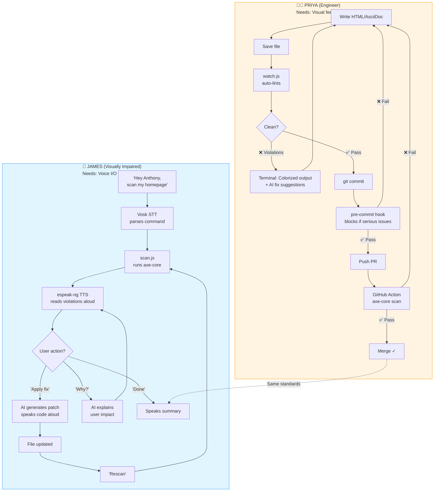

# A11Y Agent — Simplified Pipeline Flow

## Two Personas, One Tool

---

## Key Meeting Decisions

| Decision | Implementation |
|----------|---------------|
| **Voice feedback timing** | Triggers on SAVE only (not during typing) via `watch.js` + `--voice` flag |
| **Document scope** | Extended to `.adoc` files (Red Hat content) |
| **Local models** | Ollama support (Llama 3.1) reduces token costs 95% |
| **Git integration** | Pre-commit hook + GitHub Actions block bad merges |
| **Repository security** | Private until benchmarks ready |

---

## Branch Integration

### Surya's Branch: `surya/shift-left-pipeline`
**What:** Developer automation pipeline  
**Key features:** watch.js, lint.js, pre-commit hook, CI/CD  
**Persona:** Priya (visual feedback)

### Dallas's Branch: `spohnz/voice-accessibility-features`  
**What:** Voice I/O for accessibility  
**Key features:** --voice, --listen, --interactive, Anthony integration  
**Persona:** James (audio feedback)

### Merge Strategy
1. Test both branches independently
2. Verify integration points (same lint.js/scan.js core)
3. Record demo showing both workflows
4. Merge to main before Sept 15

---

## Demo Script (2-3 minutes)

**[0:00-0:30] The Problem**
> "Accessibility gets checked too late. Priya ships code, an audit finds dozens of issues months later, users suffer."

**[0:30-1:30] Solution 1: Shift Left (Priya)**
- Show: Priya saves file → violations appear instantly
- Show: AI suggests exact fix → paste → violations drop to zero
- Show: Commit attempt → pre-commit hook blocks bad code
- Show: PR opens → GitHub Action enforces standards

**[1:30-2:30] Solution 2: Voice Accessibility (James)**
- Show: James (blind) says "scan my homepage"
- Show: Tool reads violations aloud
- Show: James says "apply fix" → code patched → "rescan" → "1 resolved"
- Show: No sighted assistance needed

**[2:30-3:00] The Hook**
> "We built an accessibility testing tool... and then made it accessible. Two personas, one tool, zero excuses."

---

## 15-Day Critical Path

### Week 1 (Days 1-7)
- [x] Review meeting notes ✓
- [x] Create integrated pipeline doc ✓
- [ ] Test watch.js with .adoc files
- [ ] Test all 4 voice features (TTS, STT, interactive, Anthony)
- [ ] Collect benchmark datasets (Surya)
- [ ] Test on redhat.com / PatternFly

### Week 2 (Days 8-14)
- [ ] Record demo video (both personas)
- [ ] Create architecture diagram (visual)
- [ ] Draft impact statement
- [ ] Set up GitHub Issues (track remaining work)
- [ ] Merge both branches to main
- [ ] Final testing pass

### Day 15 (Sept 15)
- [ ] Submit to Innovation Days
- [ ] Cross fingers 🤞

---

## Success = Both Personas Winning

**Priya's Win:**  
Catches issues in seconds (not months), AI suggests fixes (no googling), pre-commit blocks regressions

**James's Win:**  
Tests accessibility without sighted help, voice I/O removes barriers, same tool Priya uses

**Red Hat's Win:**  
Shift left reduces audit costs, voice features demonstrate accessibility-first culture, tool works on training content (.adoc)
