# A11Y Agent — Shift Left A11y

**AI-Powered Accessibility Testing for Red Hat Innovation Days 2026**

A11Y Agent is a **dual-persona accessibility pipeline** that combines automated detection, AI-powered fixes, and voice accessibility to serve both visual and visually impaired developers.

## Two Personas, One Tool

### 👩‍💻 Priya (Engineer)
**Need:** Real-time feedback while writing HTML/AsciiDoc to meet accessibility standards  
**Solution:** File watcher → instant linting → AI fix suggestions → pre-commit gates → CI/CD enforcement

### 🎤 James (Visually Impaired Developer)
**Need:** Accessible testing tools with voice I/O to verify product interfaces  
**Solution:** Voice commands → spoken violations → AI-guided fixes → voice-driven workflow

---

## Pipeline Flow

```mermaid
flowchart TB
    subgraph priya["👩‍💻 PRIYA - Visual Workflow"]
        P1[Write HTML/AsciiDoc] --> P2[Save file]
        P2 --> P3["watch.js auto-lints"]
        P3 --> P4{Clean?}
        P4 -->|"❌ Violations"| P5["Terminal: Colorized + AI fixes"]
        P5 --> P1
        P4 -->|"✅ Pass"| P6[git commit]
        P6 --> P7["pre-commit hook"]
        P7 -->|"❌ Fail"| P1
        P7 -->|"✅ Pass"| P8[Push PR]
        P8 --> P9["GitHub Action"]
        P9 -->|"❌ Fail"| P1
        P9 -->|"✅ Pass"| P10[Merge ✓]
    end
    
    subgraph james["🎤 JAMES - Voice Workflow"]
        J1["'Scan my homepage'"] --> J2["Vosk STT"]
        J2 --> J3["scan.js + axe-core"]
        J3 --> J4["espeak-ng TTS<br/>reads aloud"]
        J4 --> J5{"Action?"}
        J5 -->|"'Apply fix'"| J6["AI patches file<br/>speaks code"]
        J6 --> J7[Updated]
        J7 --> J8["'Rescan'"]
        J8 --> J3
        J5 -->|"'Done'"| J10[Summary]
    end
    
    style priya fill:#fff4e1
    style james fill:#e1f5ff
```



## Features

- 🔍 **Automated Detection** — Industry-standard WCAG 2.0/2.1 A/AA violation detection via axe-core
- 🤖 **AI-Powered Fixes** — Context-aware, copy-pasteable code fixes using local or cloud models
- 📚 **Developer Education** — Explanations of WHY violations matter and their impact on users with disabilities
- 🎤 **Voice I/O** — Text-to-speech output and speech-to-text input for visually impaired developers
- 👁️ **Real-time Feedback** — File watcher auto-lints on save with instant visual feedback
- 🚫 **Git Integration** — Pre-commit hooks and CI/CD gates prevent regressions
- 🦙 **Local Models** — Support for Ollama (Llama 3.1, Qwen, etc.) to reduce token costs 95%
- 📄 **Multi-format** — HTML and AsciiDoc support (Red Hat Training content)

## Quick Start

### For Priya (Visual Workflow)

```bash
# Install dependencies
npm install

# Start the file watcher (auto-lint on save)
node src/watch.js --dir samples/

# In another terminal, edit samples/bad-page.html
# Save the file → violations appear instantly in the watcher terminal

# Get AI fix suggestions (uses Ollama by default, free & local)
node src/lint.js --file samples/bad-page.html --fix

# Install pre-commit hook (blocks bad commits)
npm run install-hooks

# Try to commit a file with violations → hook blocks it
```

### For James (Voice Workflow)

```bash
# One-time voice setup
./setup-voice.sh  # Downloads Vosk model (~50MB)

# Voice command mode (push-to-talk)
node src/scan.js --listen
# Press SPACE, then speak: "scan samples/bad-page.html"

# Text-to-speech output (reads violations aloud)
node src/scan.js --file samples/bad-page.html --voice

# Interactive conversational mode
node src/scan.js --file samples/bad-page.html --fix --interactive

# Full voice workflow with Anthony (GNOME voice desktop)
# See anthony-integration/README.md for setup
```

### Universal Commands (Both Workflows)

```bash
# Scan a local HTML file
node src/scan.js --file samples/bad-page.html

# Scan a live URL
node src/scan.js --url https://example.com

# Get AI fix suggestions (model-agnostic)
node src/scan.js --file samples/bad-page.html --fix

# JSON output (for CI/CD)
node src/scan.js --url https://example.com --json

# Use a different AI model
A11Y_AI_MODEL=llama3.1:70b node src/scan.js --file samples/bad-page.html --fix
```

## What Makes This Different

### Detection is Deterministic, AI Only Explains
- **lint.js** — Static HTML/AsciiDoc checks (no browser needed) ~100ms
- **scan.js** — Browser-based axe-core scan (contrast, landmarks, etc.) ~2-5s
- **AI** — Only used for fix suggestions and explanations, NOT detection

### Voice Accessibility (We Eat Our Own Dog Food)
- **--voice** — TTS output via espeak-ng
- **--listen** — STT input via Vosk (offline, privacy-first)
- **--interactive** — Conversational Q&A mode
- **Anthony integration** — Full GNOME voice desktop workflow

### Shift Left Pipeline (Catch Issues Before Code Review)
- **watch.js** — Auto-lint on file save (real-time feedback)
- **pre-commit hooks** — Block commits with serious violations
- **GitHub Actions** — PR checks prevent regressions
- **Local models** — Ollama support reduces token costs 95%

### Multi-Format Support
- ✅ HTML files (web UIs)
- ✅ AsciiDoc files (Red Hat Training content)
- ✅ Live URLs (production sites)  

## The James Persona Story

**James** is a visually impaired developer at Red Hat. When he needs to test accessibility of a product interface, he currently needs a sighted colleague to:
1. Open the browser dev tools
2. Run the axe DevTools extension
3. Read the violations aloud
4. Google how to fix each one
5. Describe the fix code to James

**With A11Y Agent + Voice:**
1. James says: *"Scan my homepage"*
2. Tool reads violations aloud
3. James says: *"Apply the fix for missing alt text"*
4. Tool generates patch, reads it aloud
5. James says: *"Rescan"*
6. Tool confirms: *"1 violation resolved, 2 remaining"*

**Zero sighted assistance needed.**

### Voice Commands

```bash
# One-time setup (downloads Vosk model ~50MB)
./setup-voice.sh

# Start voice command mode
node src/scan.js --listen

# Press and hold SPACE, then speak:
# "scan samples/bad-page.html"
# "scan example.com and show me the fixes"
# "check accessibility of bad-page.html output as json"
```

**Features:**
- Push-to-talk interface (no wake word needed)
- Offline processing (privacy-first, uses Vosk)
- Natural language parsing ("scan X and show fixes")
- Audio feedback (beeps for recording start/stop)

See [VOICE_COMMANDS.md](VOICE_COMMANDS.md) for detailed setup and [anthony-integration/](anthony-integration/) for GNOME voice desktop integration.

## How It Works

### Detection Pipeline (Deterministic)
1. **Static lint** (lint.js) — Parse HTML/AsciiDoc, check for missing alt text, invalid ARIA, heading order, etc.
2. **Browser scan** (scan.js) — Playwright launches chromium, axe-core checks computed styles, contrast ratios, focus order
3. **Impact ranking** — Sort by Critical → Serious → Moderate → Minor

### AI Layer (Fix Suggestions Only)
1. Violations + source HTML sent to LLM (Ollama, Claude, GPT, Groq, etc.)
2. Model generates:
   - WHY the violation matters (impact on users with disabilities)
   - EXACT code fix (before → after, copy-paste ready)
   - WCAG criterion addressed
3. AI does NOT detect violations — only explains and suggests fixes

### Voice Layer (Accessibility for the Tool Itself)
1. **Input:** Vosk STT listens for push-to-talk commands (SPACE key)
2. **Parsing:** Natural language → CLI flags (e.g., "scan X and show fixes" → `--file X --fix`)
3. **Output:** espeak-ng TTS reads violations, fixes, and summaries aloud
4. **Loop:** User can navigate conversationally ("why?", "apply fix", "rescan")

### Automation Layer (Shift Left)
1. **watch.js** monitors file changes, auto-runs lint on save
2. **pre-commit hook** blocks git commits if serious violations found
3. **GitHub Actions** runs scan on every PR, blocks merge if violations exceed threshold

## Innovation Days Challenge

**Challenge 4:** "How might we ensure associates can build accessible experiences **from the start**, so users can fully engage with Red Hat products without barriers?"

**Team:** Shift Left A11y — Dallas Spohn, Surya Pathak (seeking 3rd member)  
**Deadline:** September 15, 2026 (14 days remaining)

**The Problem:**
- Accessibility checked too late (after code ships)
- Developers lack real-time guidance
- Tools themselves aren't accessible (irony: blind developers can't use accessibility checkers)
- Standards inconsistently applied

**Our Solution:**
Two workflows, one tool:
1. **Shift left** — Catch violations while code is written (watch.js, pre-commit, CI/CD)
2. **Shift accessible** — Voice I/O so visually impaired developers can self-serve

**The Hook:**
> "We built an accessibility testing tool... and then made it accessible. Because if James can't use our accessibility checker, what's the point?"

## Test It Out

The `samples/bad-page.html` file contains 9+ intentional accessibility violations:

- Missing `lang` attribute
- Skipped heading levels
- Low contrast text
- Images without alt text
- Form inputs without labels
- Icon-only links
- Tables without headers
- Non-interactive click handlers
- Auto-playing video without controls

Run the scanner to see them all detected and get AI-powered fix suggestions!

## Dependencies

**Detection (Core):**
- `playwright` — Headless browser automation
- `@axe-core/playwright` — WCAG 2.0/2.1 testing engine (~50-60% coverage)
- `commander` — CLI argument parsing
- `chalk` — Terminal color output

**AI Fixes (Model-Agnostic):**
- `@anthropic-ai/sdk` — Claude integration
- OpenAI-compatible API support (Ollama, OpenAI, Groq, etc.)
- Env vars: `A11Y_AI_URL`, `A11Y_AI_KEY`, `A11Y_AI_MODEL`

**Voice I/O (Optional):**
- `espeak-ng` — Text-to-speech (TTS)
- `vosk` — Offline speech-to-text (STT)
- `mic` — Microphone audio capture
- Vosk model files — Download via `./setup-voice.sh` (~50MB)

**Automation Pipeline:**
- `chokidar` — File watching for watch.js
- Git hooks — Pre-commit validation (scripts/pre-commit)
- GitHub Actions — CI/CD gates (.github/workflows/a11y.yml)

## Project Status

🚧 **Integration Phase** — Two branches ready to merge

### ✅ Completed (Dallas's Branch: spohnz/voice-accessibility-features)
- [x] Voice commands (Vosk STT) — `--listen` flag
- [x] Text-to-speech output (espeak-ng) — `--voice` flag
- [x] Interactive conversational mode — `--interactive` flag
- [x] Anthony integration (GNOME voice desktop) — anthony-integration/
- [x] Natural language parsing for voice commands

### ✅ Completed (Surya's Branch: surya/shift-left-pipeline)
- [x] File watcher (watch.js) — Auto-lint on save
- [x] Static HTML linter (lint.js) — No browser needed
- [x] Model-agnostic AI fixes — Ollama/Claude/GPT/Groq support
- [x] Pre-commit hook — Blocks bad commits
- [x] GitHub Actions CI/CD — PR checks
- [x] Good/bad sample pages for testing

### 🔄 In Progress (14 Days to Deadline)
- [ ] Merge both branches and test integration
- [ ] AsciiDoc support (Red Hat Training content)
- [ ] Test on real Red Hat sites (redhat.com, PatternFly)
- [ ] Record demo video (2-3 minutes, both personas)
- [ ] Create architecture diagram
- [ ] Draft impact statement
- [ ] Collect benchmark datasets (20-30 good/bad examples)

### 🎯 Post-Demo Roadmap
- [ ] Batch scanning (multiple URLs / sitemaps)
- [ ] Fix validation (re-scan after applying fixes)
- [ ] HTML/PDF report generation
- [ ] JSX/Vue component linting
- [ ] Wake word support ("hey a11y")
- [ ] Red Hat Training content pipeline integration

## License

TBD

## References

- **Integrated Pipeline:** [INTEGRATED_PIPELINE.md](INTEGRATED_PIPELINE.md) — Full technical architecture
- **Simplified Flow:** [PIPELINE_SIMPLIFIED.md](PIPELINE_SIMPLIFIED.md) — Executive summary
- **Voice Commands:** [VOICE_COMMANDS.md](VOICE_COMMANDS.md) — STT/TTS setup and usage
- **Anthony Integration:** [anthony-integration/README.md](anthony-integration/README.md) — GNOME voice desktop

## Team

**Team:** Shift Left A11y  
**Leads:** Dallas Spohn (PTL Team), Surya Pathak  
**Looking for:** 3rd team member (deadline Sept 15)  

**Red Hat Innovation Days 2026 Global AI Challenge**  
**Challenge 4:** Accessibility in Software Development at Scale

---

**Branches:**
- `spohnz/voice-accessibility-features` — Voice I/O (Dallas)
- `surya/shift-left-pipeline` — Automation pipeline (Surya)
- `main` — Merging soon after integration testing
