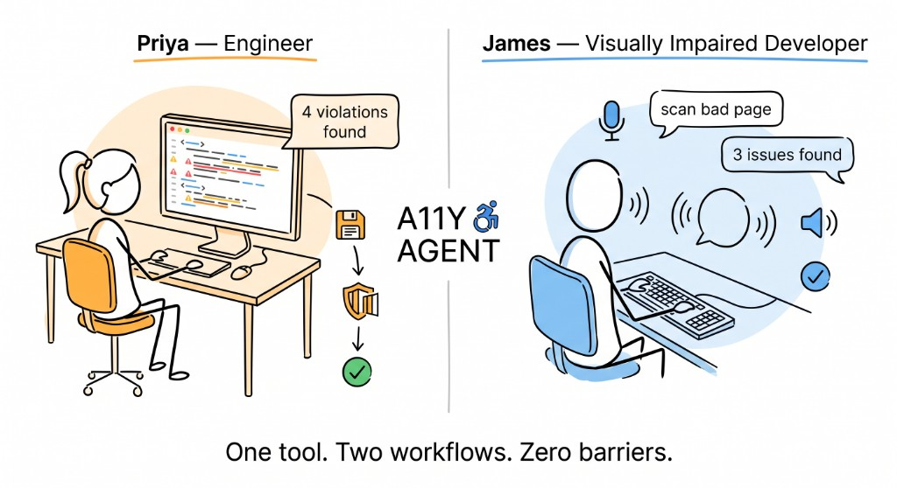
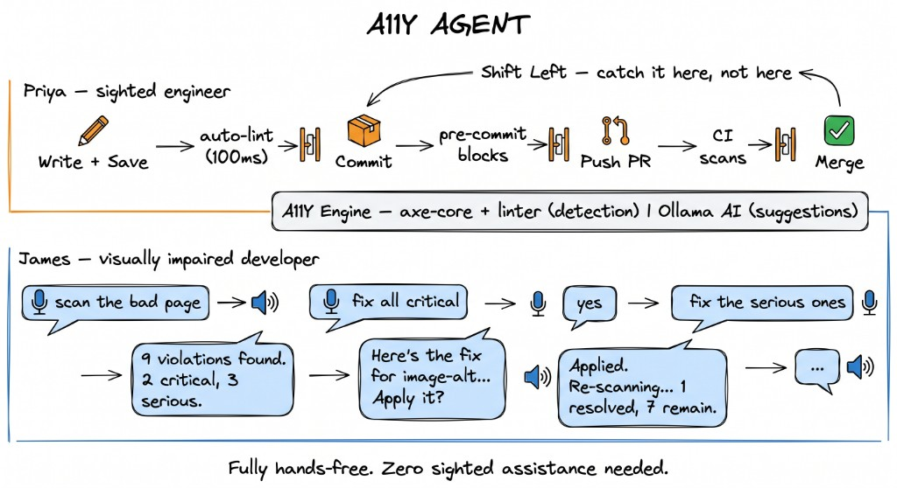

# A11Y Agent — Shift-Left Accessibility

**Red Hat Innovation Days 2026 — Challenge 4: Accessibility in Software Development at Scale**

> *"We built an accessibility testing tool — and then made it accessible."*



---

## The Problem

Accessibility is checked **too late** — after code ships, after the damage is done. And most accessibility tools aren't accessible themselves — a visually impaired developer can't open DevTools and read the results.

## The Solution

**A11Y Agent** catches WCAG violations **while you code** and makes the tool itself fully usable via voice.

| | Priya — sighted engineer | James — visually impaired developer |
|---|---|---|
| **Wants** | Real-time feedback as she writes HTML | Scan and fix a page without sighted help |
| **Uses** | Terminal, editor, VS Code squiggles | Voice commands, spoken results |
| **Flow** | Save → lint → commit gate → PR gate | Speak → scan → hear → fix → verify |

---

## Pipeline



**Design principle:** Detection is deterministic (axe-core + static rules). AI only suggests fixes — it never decides what's broken. Every fix is verified by a re-scan.

---

## Features


### Detection

- **Static HTML linter** — 12 rules, ~100ms, no browser needed. Catches missing alt, missing lang, heading order, form labels, keyboard traps, table headers.
- **axe-core browser scanner** — Industry-standard WCAG 2.0/2.1 A/AA engine via headless Chromium. Catches color contrast, computed roles, focus order.
- **Local files and live URLs** — scan `samples/bad-page.html` or `https://redhat.com`.

### AI-Powered Fixes

- **Model-agnostic** — works with any OpenAI-compatible API. Ollama (free, local) by default. Also works with OpenAI, Groq, Claude via Vertex AI, or any compatible endpoint.
- **Concrete edits** — not vague advice. Each fix shows a before/after code snippet you can copy-paste.
- **Validated** — every edit's `before` string must exist verbatim in the source. No hallucinated patches.
- **Verified** — a re-scan after applying proves the fix worked.

### Voice Workflow (James)

- **Voice triage loop** — speak commands, hear violations, select fixes by number or severity.
- **Natural grammar** — *"fix all critical"*, *"fix issue one and three"*, *"fix the first three"*.
- **Neural TTS** — Edge TTS for natural voice, espeak-ng offline fallback.
- **Offline STT** — Vosk speech recognition. No audio leaves the machine.

### Editor Integration

- **VS Code extension** — violations as squiggly underlines while you type. Install from `.vsix` or launch with F5. See [vscode-extension/](vscode-extension/).
- **File watcher** — auto-lint on save, instant feedback in the terminal.

### Browser Extension

- **Chrome extension** — auto-fixes WCAG violations on any page as it loads. No commands, no scanning — fixes happen at parse time. See [a11y-agent-chrome-plugin](https://github.com/dallasspohn/a11y-agent-chrome-plugin).

### Shift-Left Gates

- **Pre-commit hook** — blocks commits with violations.
- **GitHub Actions CI** — lint, scan, unit tests, and benchmark gate on every PR.
- **Benchmark evaluation** — 24-page test suite including the W3C WAI Before/After Demo.

---

## Quick Start

```bash
git clone https://github.com/dallasspohn/a11y-agent.git
cd a11y-agent
npm install --ignore-scripts    # skip native voice deps
npx playwright install chromium # for browser scanning
```

### Scan a file

```bash
node src/lint.js --file samples/bad-page.html         # static lint (~100ms)
node src/scan.js --file samples/bad-page.html         # browser scan (axe-core)
node src/scan.js --url https://redhat.com             # scan a live URL
node src/lint.js --file samples/bad-page.html --fix   # AI fix suggestions
```

### Voice workflow

```bash
./setup-voice.sh       # one-time: download Vosk model (~50MB)
npm run demo:agent     # reset fixture + start voice loop
npm run agent:text     # same loop, keyboard input (no mic needed)
```

### VS Code extension

```bash
# Option A: download .vsix from GitHub Releases (no clone needed)
# https://github.com/dallasspohn/a11y-agent/releases
code --install-extension a11y-agent-vscode-0.1.0.vsix

# Option B: build from source
cd vscode-extension && npm install && npm run vsix
code --install-extension a11y-agent-vscode-0.1.0.vsix

# Option C: press F5 in VS Code with the repo open (dev mode)
```

### Chrome extension

```bash
# Option A: download dist zip from GitHub Releases (no clone needed)
# https://github.com/dallasspohn/a11y-agent-chrome-plugin/releases
# Unzip → chrome://extensions → Developer mode → Load unpacked → select dist/

# Option B: build from source
git clone https://github.com/dallasspohn/a11y-agent-chrome-plugin.git
cd a11y-agent-chrome-plugin && npm install --legacy-peer-deps && npm run build
# chrome://extensions → Developer mode → Load unpacked → select dist/
```

---

## Configuration

### AI provider

Defaults to local Ollama — no API key needed. Works with any OpenAI-compatible
endpoint, plus Claude via Vertex AI as a first-class option.

| Variable | Default | Purpose |
|---|---|---|
| `A11Y_AI_URL` | `http://localhost:11434/v1` | Endpoint |
| `A11Y_AI_MODEL` | `llama3.1` | Model name |
| `A11Y_AI_KEY` | `ollama` | API key (if needed) |

```bash
# Use a different model
A11Y_AI_MODEL=qwen3:14b node src/lint.js --file page.html --fix

# Use OpenAI instead
A11Y_AI_URL=https://api.openai.com/v1 A11Y_AI_KEY=sk-... node src/scan.js --file page.html --fix
```

#### Claude via Vertex AI

Vertex serves Claude through Anthropic's own Messages API, not the OpenAI
format, so it needs its own provider flag rather than just a different
`A11Y_AI_URL`. Nothing project-specific is committed here — auth and project
come from your own environment:

```bash
npm install @anthropic-ai/vertex-sdk   # optional dep, not installed by default
gcloud auth application-default login  # or set GOOGLE_APPLICATION_CREDENTIALS

export A11Y_AI_PROVIDER=vertex
export ANTHROPIC_VERTEX_PROJECT_ID=your-gcp-project-id
export CLOUD_ML_REGION=us-east5              # your Vertex region
export A11Y_AI_MODEL=claude-3-7-sonnet@20250219  # optional, this is the default

node src/lint.js --file page.html --fix
```

| Variable | Default | Purpose |
|---|---|---|
| `A11Y_AI_PROVIDER` | `openai` | Set to `vertex` to use Claude on Vertex AI |
| `ANTHROPIC_VERTEX_PROJECT_ID` | — | Your GCP project (required for `vertex`) |
| `CLOUD_ML_REGION` | `us-east5` | Vertex region hosting the model |

### Voice

See [docs/voice.md](docs/voice.md) for setup and troubleshooting.

| Variable | Default | Purpose |
|---|---|---|
| `A11Y_VOICE_ENGINE` | `edge` | `edge` (neural) · `piper` · `espeak` (offline fallback) |
| `A11Y_VOICE_NAME` | `en-US-GuyNeural` | Edge TTS voice |

---

## Benchmark

We test our scanners against **24 HTML pages** across two datasets:

- **Handcrafted pages** (16 pages) — 8 intentionally broken pages with known violations (missing alt, bad contrast, heading chaos, keyboard traps, etc.) and 8 fixed counterparts with zero violations.
- **W3C WAI Before/After Demo** (8 pages) — an external gold-standard dataset maintained by the W3C. Four inaccessible pages and their accessible versions. We didn't write these — they're the industry benchmark.

For each page, we run both the static linter and the axe-core browser scanner, then check:

- **True Positive Rate (TPR)** — did we catch every known violation rule?
- **False Positive Rate (FPR)** — did we flag clean pages as broken?

| Metric | Score |
|---|---|
| True Positive Rate (rule recall) | **100%** |
| False Positive Rate (clean pages) | **0%** |

Every violation in every bad page is caught. No clean page is falsely flagged. CI enforces TPR ≥ 95% and FPR ≤ 5% on every PR.

```bash

npm run eval         # full benchmark report with per-rule accuracy
npm run eval:check   # CI threshold gate

```

See [evaluation/README.md](evaluation/README.md) for the full dataset and methodology.

---

## References


- [Demo site](https://dallasspohn.github.io/a11y-agent/) — Hands-on tutorial
- [vscode-extension/](vscode-extension/) — VS Code extension
- [a11y-agent-chrome-plugin](https://github.com/dallasspohn/a11y-agent-chrome-plugin) — Chrome extension
- [evaluation/README.md](evaluation/README.md) — Benchmark dataset and results
- [docs/voice.md](docs/voice.md) — Voice setup and troubleshooting

## License

[Apache License 2.0](LICENSE) — Copyright 2026 Red Hat, Inc.  
Third-party content listed in [NOTICE](NOTICE).


## Team

**Team:** Shift Left A11y  
**Leads:** Dallas Spohn (PTL Team), Surya Pathak

**Red Hat Innovation Days 2026 Global AI Challenge**  
**Challenge 4:** Accessibility in Software Development at Scale
