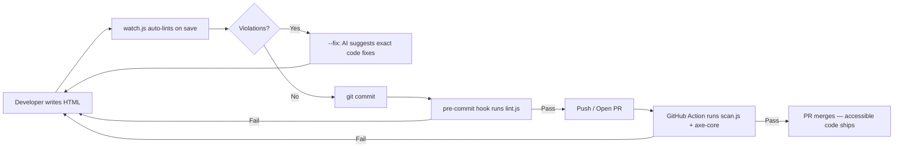

# A11Y Agent — Shift Left A11y

**Red Hat Innovation Days 2026 · Challenge 4: Accessibility in Software Development at Scale**

Team: **Shift Left A11y** · Leads: Dallas Spohn, Surya Pathak · Deadline: 15 Sep 2026

## The problem

Accessibility is checked too late. Developers ship UI, then an audit finds dozens of issues months later. Fixes take multiple releases. Users with disabilities hit barriers that should never have existed.

## What we built

A pipeline that catches accessibility violations **while code is written**, explains **how to fix them**, and **blocks merges** that reintroduce problems.

### Pipeline flow



### What each tool does

| Tool | What it does | Speed |
| --- | --- | --- |
| `lint.js` | Static HTML check — no browser needed. Catches missing alt, labels, heading order, onclick on divs, etc. | ~100ms |
| `scan.js` | Renders the page in a real browser, runs axe-core. Catches contrast, landmarks, computed ARIA, focus order. | ~2-5s |
| `watch.js` | Watches a folder, auto-runs lint on every `.html` save. | Instant |
| `--fix` flag | Sends violations + source to any LLM (Ollama, OpenAI, Anthropic, Groq). Returns why it matters + exact before/after code. | ~10-60s |
| `--fail-on` flag | Exit code 1 if violations meet a severity threshold. Powers CI gates and pre-commit hooks. | — |

Detection is **deterministic** (lint rules + axe-core). AI only explains and suggests fixes — it does not detect.

---

## Hands-on tutorial

Follow these steps to try every part of the pipeline. Uses Ollama (free, local, no API key).

### Step 0: Install

```bash
cd a11y-agent
npm install
npx playwright install chromium
```

If you don't have Ollama yet: [ollama.com](https://ollama.com). Then pull a model:

```bash
ollama pull llama3.1
```

### Step 1: Look at the broken page

Open `samples/bad-page.html` in a browser. It looks like a normal dashboard. Nothing visually screams "broken" — that is the problem.

### Step 2: Run the static linter

```bash
node src/lint.js --file samples/bad-page.html
```

You should see **11 violations** — 4 critical, 5 serious, 2 moderate. Each one names the rule, explains the issue, and shows the HTML snippet.

### Step 3: Run the full axe-core scan

```bash
node src/scan.js --file samples/bad-page.html
```

axe-core catches more: **9 violations** including contrast ratio failures and missing landmarks that the static linter can't compute.

### Step 4: Get AI fix suggestions

```bash
node src/lint.js --file samples/bad-page.html --fix
```

The linter runs, then sends violations + full HTML to Ollama. For each issue you get:
- **Why it matters** — one sentence about user impact
- **Exact code fix** — before → after, copy-paste ready
- **WCAG criterion** — which standard it addresses

Try a larger model for better suggestions:

```bash
A11Y_AI_MODEL=qwen3:14b node src/lint.js --file samples/bad-page.html --fix
```

### Step 5: Start the watcher

Open **two terminals**.

Terminal 1 — start the watcher:

```bash
node src/watch.js --dir samples/
```

Terminal 2 — open `samples/bad-page.html` in your editor. Fix one violation (e.g. change `<html>` to `<html lang="en">`). Save.

Terminal 1 instantly prints updated results. The violation count drops. Fix another, save again. Repeat until you reach 0.

This is the "Priya gets feedback while coding" experience.

### Step 6: See the fixed version

```bash
node src/lint.js --file samples/good-page.html
node src/scan.js --file samples/good-page.html
```

Both show **0 violations**. That's the before/after.

### Step 7: Test the CI gate

```bash
node src/lint.js --file samples/bad-page.html --fail-on serious
echo "Exit code: $?"
# → Exit code: 1 (build fails)

node src/lint.js --file samples/good-page.html --fail-on minor
echo "Exit code: $?"
# → Exit code: 0 (build passes)
```

### Step 8: Install the pre-commit hook

```bash
npm run install-hooks
```

Now try committing a bad HTML file — the hook runs `lint.js --fail-on serious` and blocks the commit.

### Step 9: Scan a live website

```bash
node src/scan.js --url https://spohnz.com/
```

Works on any public URL. Add `--fix` to get AI suggestions for the live site's issues.

---

## AI provider config

`--fix` uses the OpenAI-compatible chat completions API. Configure via env vars:

| Var | Default | Purpose |
| --- | --- | --- |
| `A11Y_AI_URL` | `http://localhost:11434/v1` (Ollama) | API base URL |
| `A11Y_AI_KEY` | `ollama` | API key (Ollama needs no real key) |
| `A11Y_AI_MODEL` | `llama3.1` | Model name |

Works with any OpenAI-compatible provider:

```bash
# Ollama (default — just have Ollama running)
node src/scan.js --file samples/bad-page.html --fix

# OpenAI
A11Y_AI_URL=https://api.openai.com/v1 A11Y_AI_KEY=sk-... A11Y_AI_MODEL=gpt-4o \
  node src/scan.js --file samples/bad-page.html --fix

# Anthropic
A11Y_AI_URL=https://api.anthropic.com/v1 A11Y_AI_KEY=sk-ant-... A11Y_AI_MODEL=claude-sonnet-4-20250514 \
  node src/scan.js --file samples/bad-page.html --fix

# Groq (free tier, fast)
A11Y_AI_URL=https://api.groq.com/openai/v1 A11Y_AI_KEY=gsk-... A11Y_AI_MODEL=llama-3.1-70b-versatile \
  node src/scan.js --file samples/bad-page.html --fix
```

---

## Project structure

```
a11y-agent/
├── src/
│   ├── scan.js              # axe-core scan (needs browser)
│   ├── lint.js              # Static HTML lint (no browser)
│   ├── watch.js             # File watcher (auto-lint on save)
│   └── lib/
│       ├── ai-fixes.js      # Model-agnostic LLM client
│       ├── lint-html.js     # Static lint rules
│       └── report.js        # Shared terminal output
├── samples/
│   ├── bad-page.html        # 11+ intentional violations
│   └── good-page.html       # Fixed version (0 violations)
├── scripts/
│   └── pre-commit           # Git hook — blocks bad commits
├── tests/
│   └── lint-html.test.js    # Unit tests for lint rules
├── .github/workflows/
│   └── a11y.yml             # CI — lint + scan on every PR
├── .env.example             # AI provider config template
└── package.json
```

## Roadmap

- [ ] Voice output (STT/TTS) so screen-reader users can hear scan results
- [ ] Test on real Red Hat properties (spohnz.com with planted issues)
- [ ] Batch scanning (multiple URLs / sitemap)
- [ ] HTML/PDF report generation
- [ ] JSX/Vue lint support (not only raw HTML)

## License

TBD
