# A11Y Agent — Shift Left A11y

**AI-Powered Accessibility Testing for Red Hat Innovation Days 2026**

A11Y Agent is a **dual-persona accessibility pipeline** that combines automated detection, AI-powered fixes, and voice accessibility to serve both visual and visually impaired developers.

## Two Personas, One Tool

### 👩‍💻 Priya (Engineer)
**Need:** Real-time feedback while writing HTML to meet accessibility standards  
**Solution:** File watcher → instant linting → AI fix suggestions → pre-commit gates → CI/CD enforcement

### 🎤 James (Visually Impaired Developer)
**Need:** Accessible testing tools with voice I/O to verify product interfaces  
**Solution:** Voice commands → spoken violations → cherry-picked fixes → verified re-scan

---

## Pipeline Flow

```mermaid
flowchart TB
    subgraph priya["👩‍💻 PRIYA - Visual Workflow"]
        P1[Write HTML] --> P2[Save file]
        P2 --> P3["watch.js auto-lints"]
        P3 --> P4{Clean?}
        P4 -->|"❌ Violations"| P5["Terminal: Colorized + AI fixes"]
        P5 --> P1
        P4 -->|"✅ Pass"| P6[git commit]
        P6 --> P7["pre-commit hook"]
        P7 -->|"❌ Fail"| P1
        P7 -->|"✅ Pass"| P8[Push PR]
        P8 --> P9["GitHub Action"]
        P9 -->|"❌ Fail"| P1
        P9 -->|"✅ Pass"| P10[Merge ✓]
    end

    subgraph james["🎤 JAMES - Voice Workflow (agent.js)"]
        J1["'scan bad page'"] --> J2["Vosk STT"]
        J2 --> J3["axe-core scan"]
        J3 --> J4["edge-tts reads<br/>numbered list aloud"]
        J4 --> J5{"'fix issue one<br/>and three'"}
        J5 --> J6["Per-violation JSON fixes<br/>validated against source"]
        J6 --> J7["Apply + .bak backup"]
        J7 --> J8["Verification re-scan"]
        J8 --> J9["'1 of 1 resolved,<br/>7 violations remain'"]
        J9 --> J4
    end

    style priya fill:#fff4e1
    style james fill:#e1f5ff
```



## Features

- 🔍 **Automated Detection** — Industry-standard WCAG 2.0/2.1 A/AA violation detection via axe-core
- 🤖 **AI-Powered Fixes** — Context-aware, copy-pasteable code fixes using local or cloud models
- 🎯 **Cherry-Picked Auto-Fix** — *"fix all critical"* / *"fix issue one and three"* → validated edits written to disk
- ✅ **Verified Results** — Every applied fix is proven by a re-scan, not asserted
- 📚 **Developer Education** — Explanations of WHY violations matter and their impact on users with disabilities
- 🎤 **Voice I/O** — Neural TTS output and offline STT input for visually impaired developers
- 👁️ **Real-time Feedback** — File watcher auto-lints on save with instant visual feedback
- 🚫 **Git Integration** — Pre-commit hooks and CI/CD gates prevent regressions
- 🦙 **Local Models** — Ollama by default (Llama 3.1, Qwen, etc.) — no API key, no token cost

## Quick Start

### For James (Voice Workflow)

```bash
# One-time voice setup
./setup-voice.sh          # Downloads Vosk model (~50MB)

# The full loop — resets the demo fixture, then starts listening
npm run demo:agent

# Same flow over the keyboard (no microphone needed)
npm run agent:text
```

**What happens:**

```
  A11Y AGENT
  Agent at the ready.

  What should I scan? > scan bad page

  ISSUES FOUND
  [1]  critical  Images must have alternative text          (image-alt, 2 elements)
  [2]  critical  Select element must have an accessible name (select-name, 1 element)
  [3]  serious   Elements must meet minimum color contrast   (color-contrast, 1 element)
  ...

  What should I fix? > fix issue one

  [1] image-alt
      why:  Images without alt text can't be described by screen readers.
      wcag: 1.1.1 Non-text Content
      - 
      + 

  Apply them? > yes

  Applied 2 edits to samples/bad-page.html
  Backup: samples/bad-page.html.bak

  Re-scanning to verify...
  1 of 1 selected issue resolved. 1 more issue resolved as a knock-on
  effect. 7 violations remain.
```

**Selection grammar** — number words and digits both work, since STT never emits digits:

| Say | Meaning |
| --- | --- |
| `fix all critical` | every critical violation |
| `fix critical and serious` | two severity bands |
| `fix issue one and three` | specific issues |
| `fix issues one through four` | a range |
| `fix the first three` | first N in the list |
| `fix everything` | all of them |
| `done` / `quit` / `stop` | exit the loop |

### For Priya (Visual Workflow)

```bash
# Install dependencies
npm install

# Start the file watcher (auto-lint on save)
node src/watch.js --dir samples/

# In another terminal, edit samples/bad-page.html
# Save the file → violations appear instantly in the watcher terminal

# Get AI fix suggestions (uses Ollama by default, free & local)
node src/lint.js --file samples/bad-page.html --fix

# Install pre-commit hook (blocks bad commits)
npm run install-hooks
```

### Universal Commands (Both Workflows)

```bash
# Scan a local HTML file
node src/scan.js --file samples/bad-page.html

# Scan a live URL
node src/scan.js --url https://example.com

# Get AI fix suggestions
node src/scan.js --file samples/bad-page.html --fix

# JSON output (for CI/CD) — clean stdout, progress goes to stderr
node src/scan.js --url https://example.com --json > report.json

# Slow site? Navigation timeout defaults to 60s
node src/scan.js --url https://redhat.com --timeout 90000

# Use a different AI model
A11Y_AI_MODEL=llama3.1:70b node src/scan.js --file samples/bad-page.html --fix
```

## Configuration

### AI provider

The CLI talks to **any OpenAI-compatible endpoint** and defaults to a local Ollama.
No API key is required for the default path.

| Variable | Default | Purpose |
| --- | --- | --- |
| `A11Y_AI_URL` | `http://localhost:11434/v1` | Endpoint |
| `A11Y_AI_MODEL` | `llama3.1` | Model name |
| `A11Y_AI_KEY` | `ollama` | API key, if the endpoint needs one |

> The `@anthropic-ai/sdk` dependency is used **only** by the Anthony MCP server
> (`anthony-integration/a11y-mcp-server.js`), not by the CLI.

### Voice

One source of truth in `src/lib/tts.js`; every entry point reads it, so the
voice never changes mid-conversation. CLI flags win over environment variables.

| Variable | Default | Purpose |
| --- | --- | --- |
| `A11Y_VOICE_ENGINE` | `edge` | `edge` (neural, needs network) · `piper` · `espeak` (offline) |
| `A11Y_VOICE_NAME` | `en-US-GuyNeural` | edge-tts voice |
| `A11Y_VOICE_RATE` | `175` | Words per minute |
| `A11Y_NO_BEEP` | *unset* | Set to `1` to silence the record/stop tones |
| `A11Y_MIC_DEVICE` | `default` | ALSA capture device for STT |
| `A11Y_EDGE_TIMEOUT_MS` | `10000` | Give up on edge-tts and use espeak after this |
| `VOSK_MODEL_PATH` | *auto-detected* | Override the STT model directory |

If edge-tts or the network is unavailable, speech **falls back to espeak-ng
automatically** rather than going silent, and prints the reason. The fallback
latches for the rest of the session — retrying the network on every line would
put a multi-second stall between sentences. Restart to try the neural voice
again, or set `A11Y_VOICE_ENGINE=espeak` to skip it deliberately.

> **Recording the demo?** Input goes through PipeWire's `default` device, so the
> mic is shared — OBS can record while the agent listens. Only set
> `A11Y_MIC_DEVICE` to a raw device like `plughw:1,0` if you need to bypass the
> sound server, and expect an exclusive grab if you do.

## What Makes This Different

### Detection is Deterministic, AI Only Explains
- **lint.js** — Static HTML checks (no browser needed) ~100ms
- **scan.js** — Browser-based axe-core scan (contrast, landmarks, etc.) ~2-5s
- **AI** — Only used for fix suggestions and explanations, NOT detection

### Applied Fixes Are Validated, Not Trusted
`generateFixPlan()` asks the model for **one structured JSON edit per
violation** with verbatim `before`/`after` strings, then checks every `before`
against the real source. An edit whose `before` isn't found exactly is marked
*manual* instead of applied — so a hallucinated edit can't corrupt the file.
Every write makes a `.bak` and is followed by a verification re-scan.

### Voice Accessibility (We Eat Our Own Dog Food)
- **agent.js** — The full hands-free triage loop (`npm run agent`)
- **--voice** — TTS output, edge-tts neural by default, espeak fallback
- **--listen** — STT input via Vosk (offline, privacy-first)
- **--interactive** — Conversational Q&A mode
- **Anthony integration** — 🚧 scaffolding written, not installed or wired up

### Shift Left Pipeline (Catch Issues Before Code Review)
- **watch.js** — Auto-lint on file save (real-time feedback)
- **pre-commit hooks** — Block commits with serious violations
- **GitHub Actions** — PR checks prevent regressions
- **Local models** — Ollama support removes per-token cost entirely

### Multi-Format Support
- ✅ HTML files (web UIs)
- ✅ Live URLs (production sites)
- 🚧 React/JSX components (planned)

## The James Persona Story

**James** is a visually impaired developer at Red Hat. When he needs to test accessibility of a product interface, he currently needs a sighted colleague to:
1. Open the browser dev tools
2. Run the axe DevTools extension
3. Read the violations aloud
4. Google how to fix each one
5. Describe the fix code to James

**With A11Y Agent + Voice:**
1. James runs `a11y-agent` and hears *"Agent at the ready"*
2. He says *"scan bad page"* — the tool speaks the summary and reads a numbered list
3. He says *"fix all critical"* — the tool generates and reads the fixes
4. He says *"yes"* — the file is patched, with a backup
5. The tool re-scans and confirms: *"1 of 1 selected issue resolved. 7 violations remain."*

**Zero sighted assistance needed.**

### Voice Commands

```bash
# One-time setup (downloads Vosk model ~50MB)
./setup-voice.sh

# Verify the recognizer without a microphone
npm run test:vosk

# Start voice command mode
node src/scan.js --listen

# Press SPACE, then speak:
# "scan red hat dot com"
# "scan example.com and show me the fixes"
```

**Behavior:**
- **SPACE is a toggle, not push-to-talk.** Terminals emit key-down events only —
  there is no key-release event — so "press and hold" isn't implementable.
  Recording starts on SPACE and stops on a pause in speech, a second SPACE, or
  the 15s safety timeout.
- Offline processing (privacy-first, uses Vosk)
- Natural language parsing, including spoken punctuation
  (*"red hat dot com"* → `https://redhat.com`)
- Short tones mark recording start/stop

> **Known limitation:** the small Vosk model will not transcribe literal file
> paths like `samples/bad-page.html`. Use spoken aliases (*"scan bad page"*,
> *"scan the good page"*) or a domain.

See [docs/voice.md](docs/voice.md) for detailed setup. [anthony-integration/](anthony-integration/) sketches a GNOME voice desktop path but is **not installed or tested** — see Project Status.

## How It Works

### Detection Pipeline (Deterministic)
1. **Static lint** (lint.js) — Parse HTML, check for missing alt text, invalid ARIA, heading order, etc.
2. **Browser scan** (scan.js / lib/scanner.js) — Playwright launches chromium, axe-core checks computed styles, contrast ratios, focus order
3. **Impact ranking** — Sort by Critical → Serious → Moderate → Minor

### AI Layer (Fix Suggestions Only)
1. Violations + source HTML sent to an OpenAI-compatible endpoint (Ollama by default)
2. Model generates WHY it matters, the exact before/after edit, and the WCAG criterion
3. Edits are validated against the real source before anything is written
4. AI does NOT detect violations — only explains and suggests fixes

### Voice Layer (Accessibility for the Tool Itself)
1. **Input:** Vosk STT, toggled with SPACE, fully offline
2. **Parsing:** Natural language → CLI flags, or → violation indices for fix selection
3. **Output:** edge-tts neural voice (espeak fallback) reads violations, fixes, and summaries
4. **Loop:** Selection → fixes → apply → verify → renumbered list → repeat

### Automation Layer (Shift Left)
1. **watch.js** monitors file changes, auto-runs lint on save
2. **pre-commit hook** blocks git commits if serious violations found
3. **GitHub Actions** runs scan on every PR, blocks merge if violations exceed threshold

## Innovation Days Challenge

**Challenge 4:** "How might we ensure associates can build accessible experiences **from the start**, so users can fully engage with Red Hat products without barriers?"

**Team:** Shift Left A11y — Dallas Spohn, Surya Pathak (seeking 3rd member)  
**Deadline:** September 15, 2026

**The Problem:**
- Accessibility checked too late (after code ships)
- Developers lack real-time guidance
- Tools themselves aren't accessible (irony: blind developers can't use accessibility checkers)
- Standards inconsistently applied

**Our Solution:**
Two workflows, one tool:
1. **Shift left** — Catch violations while code is written (watch.js, pre-commit, CI/CD)
2. **Shift accessible** — Voice I/O so visually impaired developers can self-serve

**The Hook:**
> "We built an accessibility testing tool... and then made it accessible. Because if James can't use our accessibility checker, what's the point?"

## Test It Out

`samples/bad-page.html` produces exactly **9 axe violations** —
2 critical, 3 serious, 4 moderate:

| # | Impact | Rule |
| --- | --- | --- |
| 1 | critical | `image-alt` — images without alternative text (2 elements) |
| 2 | critical | `select-name` — select with no accessible name |
| 3 | serious | `color-contrast` — text below the contrast threshold |
| 4 | serious | `html-has-lang` — missing `lang` attribute |
| 5 | serious | `link-name` — icon-only link with no discernible text |
| 6 | moderate | `heading-order` — skipped heading levels |
| 7 | moderate | `landmark-one-main` — no main landmark |
| 8 | moderate | `page-has-heading-one` — no `<h1>` |
| 9 | moderate | `region` — content outside landmarks (10 elements) |

```bash
npm run demo          # scan and print
npm run demo:lint     # static lint only, no browser
npm run demo:agent    # reset fixture + full voice loop
npm test              # 26 unit tests + a clean-page regression check
```

> ⚠️ **`npm run demo:reset` before every rehearsal.** Auto-apply edits the real
> `samples/bad-page.html`, so one practice run consumes the fixture and
> `tests/lint-html.test.js` starts failing. `npm run demo:agent` does the reset
> for you.

## Dependencies

**Detection (Core):**
- `playwright` — Headless browser automation
- `@axe-core/playwright` — WCAG 2.0/2.1 testing engine (~50-60% coverage)
- `commander` — CLI argument parsing
- `chalk` — Terminal color output

**AI Fixes (Model-Agnostic):**
- `openai` — OpenAI-compatible client (Ollama, OpenAI, Groq, vLLM, …)
- `@anthropic-ai/sdk` — Claude, used only by the Anthony MCP server
- Env vars: `A11Y_AI_URL`, `A11Y_AI_KEY`, `A11Y_AI_MODEL`

**Voice I/O (Optional):**
- `edge-tts` — Neural text-to-speech (`pip install edge-tts`)
- `espeak-ng` — Offline TTS fallback
- `vosk` — Offline speech-to-text (STT)
- `mic` + `arecord` — Microphone audio capture
- Vosk model files — Download via `./setup-voice.sh` (~50MB)
- Build tools for the native modules: `sudo dnf install gcc-c++ make`

**Automation Pipeline:**
- `chokidar` — File watching for watch.js
- Git hooks — Pre-commit validation (scripts/pre-commit)
- GitHub Actions — CI/CD gates (.github/workflows/a11y.yml)

## Project Status

🎬 **Demo Prep** — both persona pipelines merged into `main`

### ✅ Completed — Voice / James
- [x] Voice commands (Vosk STT) — `--listen` flag
- [x] Text-to-speech output — `--voice` flag, edge-tts neural with espeak fallback
- [x] Interactive conversational mode — `--interactive` flag
- [x] Natural language parsing for voice commands
- [x] **Voice triage loop with cherry-picked auto-fix** — `npm run agent`
- [x] **Fix validation** — re-scan after applying, reports knock-on fixes

### ✅ Completed — Pipeline / Priya
- [x] File watcher (watch.js) — Auto-lint on save
- [x] Static HTML linter (lint.js) — No browser needed
- [x] Model-agnostic AI fixes — Ollama/OpenAI/Groq support
- [x] Pre-commit hook — Blocks bad commits
- [x] GitHub Actions CI/CD — PR checks
- [x] Good/bad sample pages for testing

### 🚧 Written But Not Wired Up
- [ ] **Anthony integration** — `anthony-integration/` contains a command
      module, MCP server, and installer, but `install.sh` has never been run:
      `a11y.py` is not present in `anthony/commands/`. The MCP server also
      needs `ANTHROPIC_API_KEY` and pins `claude-sonnet-4-20250514`. Treat this
      as a design sketch, not a working path. **Do not demo it.**

### 🔄 Remaining Before Sept 15
- [x] Test the agent loop with a real microphone end to end
- [ ] VS Code extension — live diagnostics on save (`spohnz/vscode-extension`)
- [ ] Improve auto-fix quality on landmark/heading rules (see Known Issues)
- [ ] Test on real Red Hat sites (redhat.com, PatternFly, console.redhat.com)
- [ ] Record demo video (2-3 minutes, both personas)
- [ ] Create architecture diagram
- [ ] Draft impact statement
- [ ] Collect benchmark datasets (20-30 good/bad examples)

### 🎯 Post-Demo Roadmap
- [ ] Batch scanning (multiple URLs / sitemaps)
- [ ] HTML/PDF report generation
- [ ] JSX/Vue component linting
- [ ] Wake word support ("hey a11y")
- [ ] Red Hat Training content pipeline integration

## Known Issues

- **Auto-fix quality varies by rule.** `image-alt` and `html-has-lang` are
  reliable. Structural rules (`landmark-one-main`, `page-has-heading-one`,
  `region`) can produce edits on local `llama3.1` that introduce *new*
  violations — e.g. `role="main"` on `<html>`, or two sibling `<main>`
  elements. **Review the diff before accepting**, and prefer a larger model for
  structural fixes. The `.bak` file is your undo.
- **Fix generation is slow locally** — roughly 30s per violation on `llama3.1`.
  Select one or two issues during a live demo rather than *"fix everything"*.
- **`select-name` reliably produces no automatic edit** — the tool reports it as
  needing a human, which is the correct behavior, not a bug.
- **Auto-apply only works on local files**, not URLs.

## License

TBD

## References

- **Voice setup:** [docs/voice.md](docs/voice.md) — STT/TTS install, mic config, troubleshooting
- **Anthony integration:** [anthony-integration/README.md](anthony-integration/README.md) — GNOME voice desktop (design sketch, not wired up)

This README is the entry point. Everything else that used to live at the repo
root described the pre-agent architecture and has been removed — `git log` has
it if you need it.

## Team

**Team:** Shift Left A11y  
**Leads:** Dallas Spohn (PTL Team), Surya Pathak  
**Looking for:** 3rd team member (deadline Sept 15)

**Red Hat Innovation Days 2026 Global AI Challenge**  
**Challenge 4:** Accessibility in Software Development at Scale
